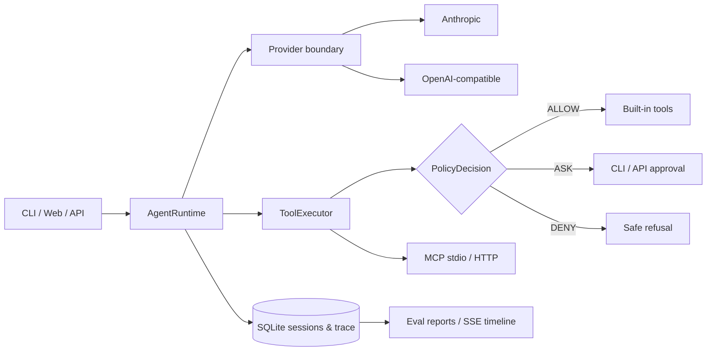

# Nexus Agent

[中文](README.md) · Python 3.10–3.14 · MIT

Nexus Agent is a runnable, evaluable, traceable, and demo-ready coding-agent runtime. It puts model calls, tool execution, approvals, MCP lifecycle, session isolation, and observability behind stable asynchronous interfaces instead of hard-coding business workflows.

> Agent = Model + Runtime. The model chooses the next step; the runtime executes it reliably and safely.

The project originates from shareAI Lab's MIT-licensed [learn-claude-code](https://github.com/shareAI-lab/learn-claude-code) teaching example. Tasks, tools, and collaboration primitives came from that migration. The async runtime, provider boundary, unified policy, real MCP transports, SQLite tracing, deterministic evaluation, FastAPI/SSE API, Web console, and cross-platform engineering are the production-oriented additions made here.

## Capabilities

- `AgentRuntime.run`: async-first loop; one session is serialized while separate sessions run concurrently with isolated history.
- `Provider.complete`: Anthropic Messages and OpenAI-compatible adapters. Compatible domestic services need only URL, model, and key configuration.
- `ToolExecutor.execute`: every entry point shares `ALLOW / ASK / DENY`; workspace escape is denied and risky actions need one-time approval.
- MCP: official Python SDK, stdio and Streamable HTTP, `mcp__server__tool` names, and an explicit environment allowlist.
- Tracing: sessions, runs, and events in SQLite with JSONL export, secret redaction, and result truncation.
- Evaluation: deterministic offline scripted provider and opt-in live mode.
- API/UI: FastAPI, SSE timeline, approval controls, and run metrics in native HTML/CSS/JS with no npm dependency.




## Five-minute start

```bash
git clone <your-repository-url>
cd nexus-agent
uv sync --extra dev

# No API key required
uv run python -m nexus_agent --help
uv run pytest -q
uv run nexus-agent eval evals/smoke.yaml
uv run nexus-agent serve --host 127.0.0.1 --port 8000
```

Open `http://127.0.0.1:8000`. Tests and offline evaluation use neither the network nor an API key. Without uv, create a virtual environment and run `python -m pip install -e ".[dev]"`.

For a live model, copy `.env.example` to `.env`, fill in the four `NEXUS_*` provider fields, and run:

```bash
nexus-agent run "Summarize this project's architecture" --json
nexus-agent chat
nexus-agent eval evals/smoke.yaml --live
```

`openai_compatible` targets providers implementing Chat Completions tool calling. Never place an API key in `mcp.json`, a command line, or version control.

## MCP

```bash
cp mcp.example.json mcp.json
nexus-agent run "Call the demo MCP echo tool"
```

The example starts a real Python subprocess; `mcp.json` is ignored by default. See `examples/mcp_echo_server.py`.

## API

| Method | Path | Purpose |
|---|---|---|
| `POST` | `/api/sessions` | Create an isolated session |
| `POST` | `/api/sessions/{id}/runs` | Submit an asynchronous run |
| `GET` | `/api/runs/{id}` | Read status and metrics |
| `GET` | `/api/runs/{id}/events` | Stream SSE events |
| `POST` | `/api/runs/{id}/approvals/{approval_id}` | Approve or reject a risky action |
| `GET` | `/healthz` | Health check |

## Verified metrics

Offline results measured on 2026-09-07 with Windows and Python 3.14. Latency is a local regression signal, not a live-model benchmark.

| Metric | Result |
|---|---:|
| Tests | 66 passed |
| Production-runtime coverage | 87.47% |
| Offline evaluation | 10 / 10 |
| Mean case latency | 49.40 ms |
| Tool success rate | 85.71% |
| Expected safety blocks | 2 |

Expected safety blocks are excluded from the tool-success denominator; the only tool error is an intentionally injected unknown tool used to verify recovery. CI covers Python 3.10–3.14 on Ubuntu and the full smoke suite on Windows/macOS with Python 3.12. Coverage measures the v0.2 production runtime; the preserved v0.1 teaching compatibility layer is explicitly excluded in `pyproject.toml`.

## Design boundaries

- The local shell is a capability boundary, not a security sandbox; this release makes no Docker-sandbox claim.
- The API has no account system and is intended for local or trusted-network use.
- SQLite is suitable for a single-node demo, not a distributed queue.
- Live CLI/Web acceptance requires a real tool-capable model key supplied by the user; offline delivery does not.

Read more: [applications and evolution (Chinese)](docs/nexus-applications-and-evolution.zh-CN.md) · [architecture](docs/architecture.md) · [interview guide (Chinese)](docs/interview-guide.zh-CN.md) · [resume notes (Chinese)](docs/resume-notes.zh-CN.md) · [status](docs/progress.md).

## License

MIT. See [LICENSE](LICENSE). The origin and addition boundaries are stated above.
