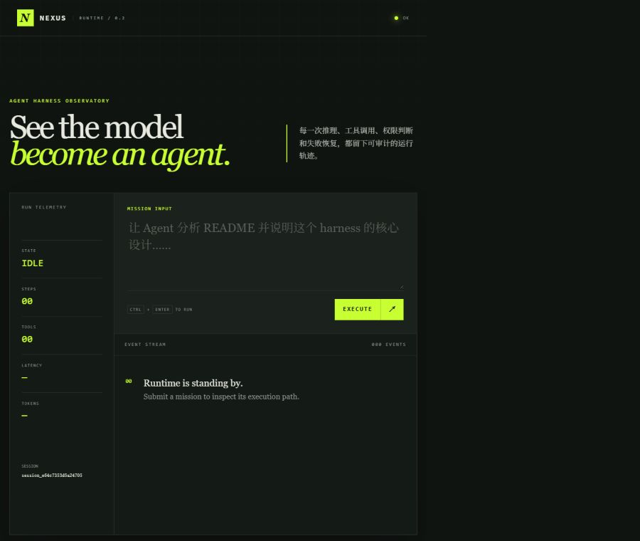

# Nexus Agent

Nexus Agent v0.3 是面向软件工程项目的 Workspace Agent Runtime。RuntimeHost 管理 Workspace 与 Session，运行事实统一写入 Event Log；消息、运行状态和模型上下文都从日志投影生成。CLI、HTTP API 和现有 Web 控制台使用同一执行主链。

主要能力：

- async-first Agent loop，同一 Workspace 串行、不同 Workspace 并发；
- Anthropic Messages、OpenAI-compatible Chat Completions 和 OpenAI Responses API；
- `ALLOW / ASK / DENY` 权限决策与 CLI、Web 一次性审批；
- MCP stdio 与 Streamable HTTP 工具发现和调用；
- SQLite 追加式 Event Log、持久上下文 checkpoint 与 JSONL 导出；
- 中断检测、停驻与用户主动 Continue，不自动重放工具副作用；
- scripted provider 离线评测与真实模型 live eval；
- FastAPI、SSE 事件流和原生中文 Web 控制台。



## 环境要求

- Python 3.10–3.14；
- 推荐使用 [uv](https://docs.astral.sh/uv/) 管理环境；
- 只有连接真实模型时才需要 API Key，帮助命令、单元测试和离线评测不需要网络或密钥。

## 安装

使用 uv：

```bash
uv sync --extra dev
```

不使用 uv：

```bash
python -m venv .venv

# Windows
.\.venv\Scripts\Activate.ps1

# Linux / macOS
source .venv/bin/activate

python -m pip install -e ".[dev]"
```

## 五分钟运行

无需 API Key 即可检查 CLI、运行测试和离线评测：

```bash
uv run python -m nexus_agent --help
uv run pytest -q
uv run nexus-agent eval evals/smoke.yaml
```

启动 Web 控制台：

```bash
uv run nexus-agent serve --host 127.0.0.1 --port 8000
```

浏览器打开 `http://127.0.0.1:8000`。通过右上角“设置”填写 Provider、模型名称、Base URL 和 API Key，可以先检查连接，再保存并应用。模型配置由同一 Host 的所有工作区共用。配置写入状态根的 `runtime.sqlite`，API Key 使用同目录 `secret.key` 或 `NEXUS_SECRET_KEY` 加密。

默认状态根：Windows 为 `%LOCALAPPDATA%\Nexus`，macOS 为 `~/Library/Application Support/Nexus`，Linux 为 `$XDG_STATE_HOME/nexus`（未设置时 `~/.local/state/nexus`）。`NEXUS_STATE_DIR` 可覆盖；相对路径相对于启动工作目录解析。状态目录独占：`serve` 运行期间，使用同一状态根的另一 CLI/Host 会明确报错，首版没有跨进程客户端协议。

v0.2 数据库不自动迁移。请关闭旧进程后选择新的状态根；旧 `.nexus/nexus.db`、历史和密钥不会被程序自动删除或导入。新状态根需要重新配置模型。测试和离线评测不需要 API Key。

## Workspace 与 Continue

```bash
uv run nexus-agent workspace add /path/to/project
uv run nexus-agent workspace list
uv run nexus-agent workspace show ws_example
uv run nexus-agent run "检查项目测试" --workspace /path/to/project --json
uv run nexus-agent chat --workspace ws_example
uv run nexus-agent serve --workspace /path/to/project
uv run nexus-agent continue session_example --json
```

省略 `--workspace` 时使用当前目录；Git 仓库内的子目录归一化到仓库根，非 Git 目录也可运行。每个 Session 固定绑定一个 Workspace。根目录 `AGENTS.md` 加入模型上下文，`mcp.json` 按 Workspace 加载。生产默认工具为 `bash/read_file/write_file/edit_file/glob/compact`；旧 task、worktree、teammate 等接口仍可导入，但不进入新 Runtime 默认工具目录。`workspace remove <id>` 只移除没有 Session 的注册记录，不删除项目文件。

Host 重启会把未结束的 run 标记为 `interrupted`，Session 显示为 `parked`。Continue 必须由用户发起；它检查 Git HEAD、暂存/未暂存改动及未跟踪文件是否匹配最后可信 checkpoint，并拒绝存在未知 Bash、MCP 或写工具结果的历史。通过检查后创建新 turn/run，旧用户消息不会重复写入，未完成的只读调用会标记为 abandoned。非 Git、未提交过的 Git 仓库、包含 submodule 的项目或缺少可信 checkpoint 时不支持 Continue。检查范围是 Git 可见源码，不覆盖 ignored 文件或外部系统状态。

上下文摘要只覆盖已结束的 turn，原始事件不变。摘要之后仍超预算时，当前 turn 内较早的工具结果会折叠为占位串（保留最近三条原文，事件日志与工作记录仍保存完整结果），并记录 `context.trimmed`。仍无法在预算内保留时返回 `context_overflow`，不会静默丢弃当前交互。预算单位保持为序列化消息的字符数。

HTTP 保留原有 session/run/approval/SSE 路由，新增 Workspace 注册、查询、无会话记录移除、项目会话列表、session/messages 和 Session Run History 查询。`POST /api/sessions` 可传 `workspace_id`；空请求继续绑定启动项目。`POST /api/sessions/{id}/continue` 等待新 run 完成并返回 RunResult，验证失败返回 409；Web 工作台通过 Session 状态与 Run History 发现 Continue 创建的新 Run，再消费同一 SSE 事件流。同 Workspace 的并发 HTTP 请求返回 409。Web 控制台以 Workspace、Session 和语义化运行阶段组织事件，不直接展示底层 Runtime 日志。

## Web 工作记录页

左侧选择 Workspace 和持续存在的工作（Session），正文优先展示工作目标、当前状态与最近成果；“本次执行结束”不代表 Session 被关闭。首次浏览不自动创建空 Session，点击“新建工作”或首次提交目标时才创建。刷新会恢复该 Workspace 上次选择的工作。

工作经过按用户意图及其 Continue 链分章，较早章节按需加载，工具操作默认折叠。工具请求与结果配对后展示对象和执行状态；“操作完成”不额外宣称测试全部通过。原始 Events、模型协议、工具参数和 checkpoint 通过临时右侧详情查看。结果支持标题、列表、代码和安全链接的 Markdown 子集，以及复制；原始 HTML 不执行。

停驻时输入区切换为 Continue 操作，通过后立即展示接续过程；校验失败保留停驻状态与原因。仅最新停驻工作提供 Continue。审批直接在正文提供“本次允许”和“拒绝”。同 Workspace 忙碌时不能再次提交；历史仍可浏览。正文独立滚动，底部操作区保持可达，小屏也可切换 Workspace、新建工作和查看详情。

Web 运行不依赖 Node 或前端构建。开发时可用 Node.js 22+ 运行 `node --test tests/web.test.mjs`；pytest 检测到合适的 Node 时也会执行这些离线投影和传输检查。另有 `node tests/web_browser.cjs` 浏览器验收，需预先提供 Playwright 与 Chromium；`NEXUS_PLAYWRIGHT_MODULE` 可指定已安装的包路径，`NEXUS_BROWSER_CHANNEL=msedge` 可使用已安装的 Edge。浏览器测试使用内存 HTTP/SSE 样例，不读取用户数据库或连接模型，截图写入忽略目录 `.task_outputs/`。

## 配置真实模型

可以通过 Web 控制台保存配置，也可以复制环境变量模板：

```bash
cp .env.example .env
```

核心变量：

```dotenv
NEXUS_PROVIDER=openai_compatible
NEXUS_API_KEY=replace-me
NEXUS_BASE_URL=https://provider.example/v1
NEXUS_MODEL=tool-capable-model
```

`NEXUS_PROVIDER` 支持：

- `anthropic`：Anthropic Messages API；
- `openai_compatible`：兼容 OpenAI Chat Completions tool calling 的服务；
- `openai_responses`：OpenAI Responses API。

运行一次任务或进入交互模式：

```bash
uv run nexus-agent run "概括当前仓库的结构" --json
uv run nexus-agent chat
```

使用真实 Provider 运行评测：

```bash
uv run nexus-agent eval evals/smoke.yaml --live
```

## 使用 MCP

复制示例配置并启动一次任务：

```bash
cp mcp.example.json mcp.json
uv run nexus-agent run "调用 demo MCP echo 工具"
```

`mcp.json` 支持 stdio 和 Streamable HTTP。stdio 服务只会收到配置中显式列出的环境变量，发现的工具统一命名为 `mcp__server__tool`。本地 `mcp.json` 默认不会提交到 Git。

## 安全提醒

- 不要把 API Key 写入命令行、`mcp.json`、代码或提交记录；
- Web 模型配置的写入、清除和连接检查只接受本机回环请求；
- 本地 Shell 执行器会在宿主机运行命令，权限策略不等于操作系统沙箱；
- 状态根包含本地配置、数据库和 trace，不应提交或公开；项目内的 `.nexus/` 仍受 Git 忽略。

## 进一步阅读

- [系统架构](docs/architecture.md)
- [架构决策](docs/decisions.md)

## License

本项目采用 MIT License，详见 [LICENSE](LICENSE)。
