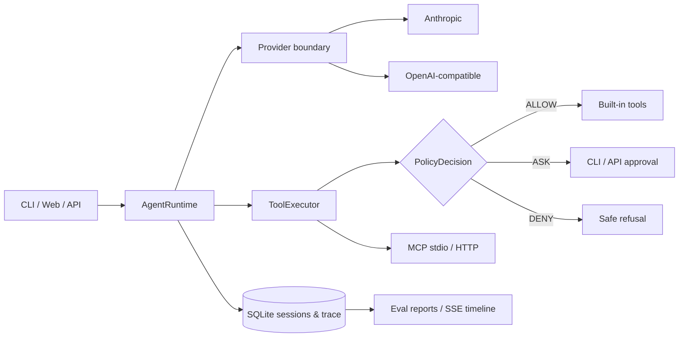

# Nexus Agent

[English](README.en.md) · Python 3.10–3.14 · MIT

Nexus Agent 是一个可运行、可评测、可追踪、可演示的 coding-agent runtime。它把模型调用、工具执行、权限审批、MCP 生命周期、会话隔离和可观测性收敛到稳定的异步接口，而不是把业务流程硬编码进 agent。

> Agent = Model + Runtime。模型决定下一步；Runtime 负责可靠、安全地执行。

本项目源自 shareAI Lab 的 [learn-claude-code](https://github.com/shareAI-lab/learn-claude-code) MIT 教学示例。任务/工具/协作等基础能力来自原始迁移；异步 Runtime、provider boundary、统一权限策略、真实 MCP、SQLite trace、确定性评测、FastAPI/SSE、Web 控制台和跨平台工程化是本项目新增的生产化扩展。

## 能力

- `AgentRuntime.run`：async-first agent loop；同一 session 串行，不同 session 并发且历史隔离。
- `Provider.complete`：Anthropic Messages 与 OpenAI-compatible 适配器；国内兼容服务仅配置 URL、model、key。
- `ToolExecutor.execute`：所有入口共享 `ALLOW / ASK / DENY`；越界访问硬拒绝，危险操作需要一次性审批。
- MCP：官方 Python SDK，支持 stdio 和 Streamable HTTP，统一命名 `mcp__server__tool`，环境变量显式白名单。
- Trace：SQLite 保存 session/run/event，可导出 JSONL；密钥脱敏，大结果截断。
- Eval：scripted provider 离线确定性执行；live 模式复用真实 provider。
- API/UI：FastAPI、SSE 时间线、审批按钮和运行指标；原生 HTML/CSS/JS，无 npm。




## 五分钟运行

```bash
git clone <your-repository-url>
cd nexus-agent
uv sync --extra dev

# 无 API Key 也能运行
uv run python -m nexus_agent --help
uv run pytest -q
uv run nexus-agent eval evals/smoke.yaml
uv run nexus-agent serve --host 127.0.0.1 --port 8000
```

浏览器打开 `http://127.0.0.1:8000`。离线评测和测试不访问网络，也不读取 API Key。不用 uv 时可创建 venv 后执行 `python -m pip install -e ".[dev]"`。

真实模型配置：

```bash
cp .env.example .env
# 填写 NEXUS_PROVIDER / NEXUS_API_KEY / NEXUS_BASE_URL / NEXUS_MODEL
nexus-agent run "概括这个项目的架构" --json
nexus-agent chat
nexus-agent eval evals/smoke.yaml --live
```

`openai_compatible` 面向实现 Chat Completions tool calling 的兼容服务；不要把 API Key 写进 `mcp.json`、命令行或提交记录。

## MCP

```bash
cp mcp.example.json mcp.json
nexus-agent run "调用 demo MCP echo 工具"
```

示例配置启动真实 Python 子进程；`mcp.json` 默认忽略提交。示例服务器见 `examples/mcp_echo_server.py`。

## API

| 方法 | 路径 | 用途 |
|---|---|---|
| `POST` | `/api/sessions` | 创建隔离会话 |
| `POST` | `/api/sessions/{id}/runs` | 异步提交任务 |
| `GET` | `/api/runs/{id}` | 查询状态和指标 |
| `GET` | `/api/runs/{id}/events` | SSE 事件流 |
| `POST` | `/api/runs/{id}/approvals/{approval_id}` | 批准/拒绝危险操作 |
| `GET` | `/healthz` | 健康检查 |

## 已验证指标

以下是 2026-09-07 在 Windows、Python 3.14 本机的离线结果；延迟只用于本地回归，不代表线上模型性能。

| 指标 | 结果 |
|---|---:|
| 测试 | 66 passed |
| 生产 Runtime 覆盖率 | 87.47% |
| 离线评测 | 10 / 10 |
| 平均用例延迟 | 49.40 ms |
| 工具成功率 | 85.71% |
| 预期安全拦截 | 2 |

工具成功率排除了预期安全拦截；唯一工具错误是用于验证恢复能力的未知工具注入。CI 在 Ubuntu 测试 Python 3.10–3.14，并在 Windows/macOS Python 3.12 执行完整 smoke test。覆盖率只统计 v0.2 生产 Runtime；保留的 v0.1 教学兼容层在 `pyproject.toml` 中明确排除。

## 设计边界

- 本地 shell 是能力边界，不是安全沙箱；本期不宣称 Docker 级隔离。
- API 无账号系统，只适合本机或受信网络。
- SQLite 适合单机演示，不是分布式队列。
- live CLI/Web 验收需要用户提供一个支持工具调用的真实 Key；离线交付不依赖它。

深入阅读：[应用面与技术演进](docs/nexus-applications-and-evolution.zh-CN.md) · [架构](docs/architecture.md) · [面试说明](docs/interview-guide.zh-CN.md) · [简历素材](docs/resume-notes.zh-CN.md) · [当前状态](docs/progress.md)。

## License

MIT，见 [LICENSE](LICENSE)。原项目归属与新增边界如上明确说明。
