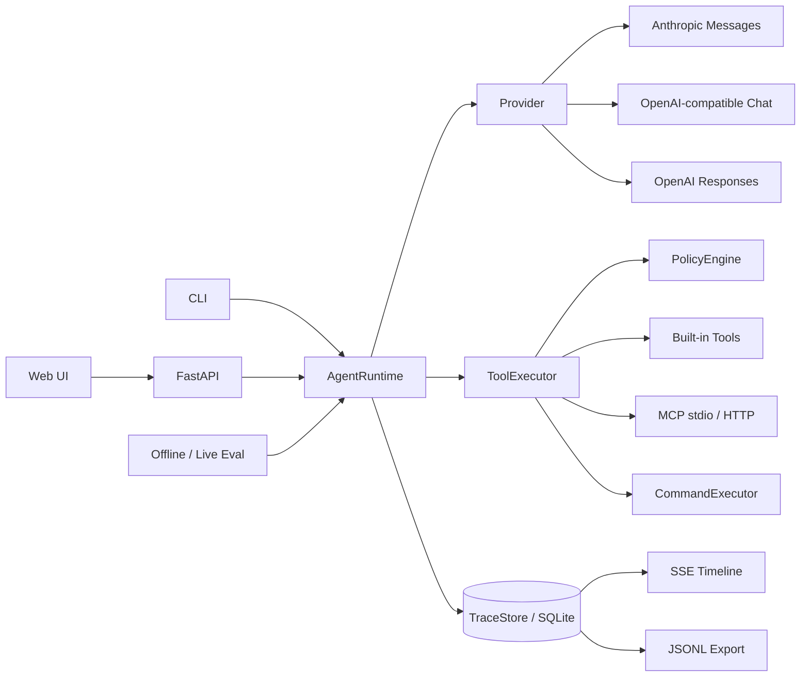
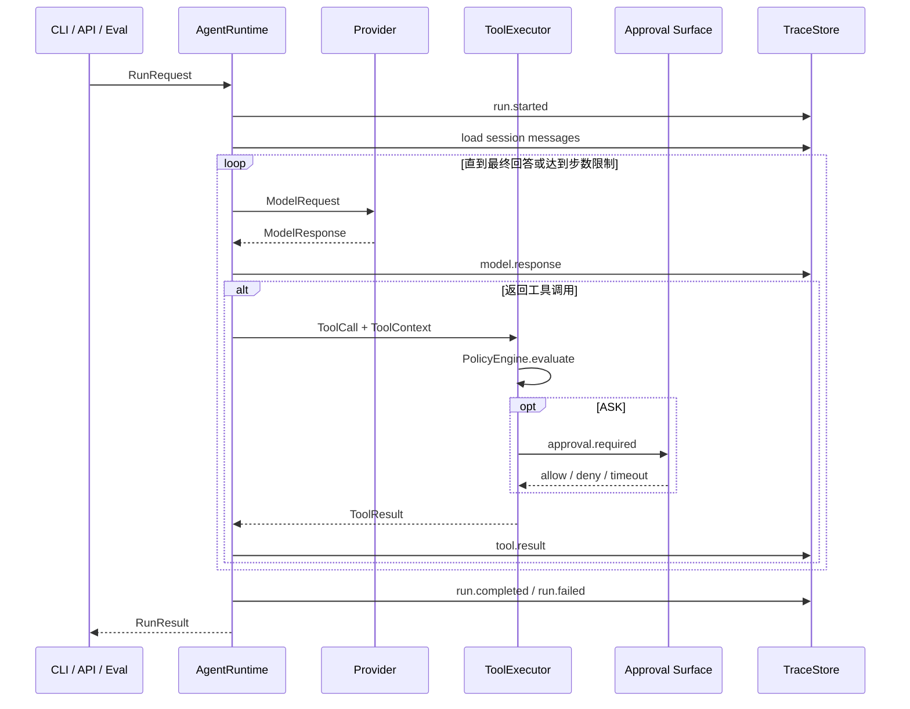

# Nexus Agent 架构

本文描述 Nexus Agent 当前实现的结构、数据模型和工程约定。设计原因记录在 [decisions.md](decisions.md)。

## 系统结构



| 组件 | 职责 |
|---|---|
| CLI / FastAPI / Web | 接收任务、展示事件并提供审批界面 |
| `AgentRuntime` | 管理 session、模型—工具循环、重试、压缩和运行结果 |
| `Provider` | 在统一模型协议与厂商 API 之间转换 |
| `ToolExecutor` | 执行统一工具调用并返回 `ToolResult` |
| `PolicyEngine` | 在工具执行前返回 `ALLOW`、`ASK` 或 `DENY` |
| `MCPManager` | 管理 MCP 连接、工具发现、命名和关闭 |
| `TraceStore` | 持久化 session、message、run、event 和模型配置 |
| Evaluation | 使用 scripted 或真实 Provider 执行评测用例 |

## 稳定接口

```python
await AgentRuntime.run(request: RunRequest, sink: EventSink) -> RunResult
await Provider.complete(request: ModelRequest) -> ModelResponse
await ToolExecutor.execute(call: ToolCall, context: ToolContext) -> ToolResult
```

`AgentRuntime` 是唯一编排核心。CLI、API 和评测只负责构造请求、提供审批处理器以及消费事件，不在入口层复制 Agent loop。

## Run 数据流



同一 `session_id` 的 run 由独立 `asyncio.Lock` 串行化。不同 session 使用不同锁和消息历史，可以并发执行。

## Runtime 数据模型

| 模型 | 主要字段 | 用途 |
|---|---|---|
| `RunRequest` | `prompt`、`session_id?`、`run_id?` | 提交一次 Agent 任务 |
| `RunResult` | `run_id`、`session_id`、`status`、`output`、`steps`、`tool_calls`、`duration_ms`、`usage` | 返回任务结果与指标 |
| `ModelRequest` | `system`、`messages`、`tools`、`model`、`max_tokens` | Provider 中立的模型请求 |
| `ModelResponse` | `text`、`tool_calls`、`stop_reason`、`usage`、`provider_items` | Provider 中立的模型响应 |
| `ToolCall` | `id`、`name`、`arguments` | 模型请求执行一个工具 |
| `ToolResult` | `call_id`、`name`、`content`、`is_error` | 工具执行结果 |
| `ToolContext` | `cwd`、`run_id`、`policy`、`approval_handler?` | 工具运行作用域和审批入口 |
| `PolicyResult` | `decision`、`reason` | 权限判断结果 |

Responses Provider 的私有 reasoning item 保存在 `ModelResponse.provider_items` 中，并以 `provider_state` block 回放。其他 Provider 会忽略该私有状态。

## SQLite 数据模型

默认数据库为 `.nexus/nexus.db`，启用 WAL 模式。

| 表 | 主键 | 主要字段 | 关系与用途 |
|---|---|---|---|
| `sessions` | `id` | `created_at`、`updated_at` | 一个会话对应有序消息和多个 run |
| `messages` | `(session_id, seq)` | `role`、`content_json` | 按 session 保存模型历史 |
| `runs` | `id` | `session_id`、`status`、时间、输出、步骤、工具数、耗时、usage、error | 保存一次运行的最终状态 |
| `events` | `(run_id, seq)` | `ts`、`type`、`payload_json` | 保存 run 的有序事件流 |
| `provider_config` | 固定 `id = 1` | `provider`、`base_url`、`model`、`api_key_ciphertext`、`updated_at` | 保存单机模型配置 |

当前 schema 在进程启动时使用 `CREATE TABLE IF NOT EXISTS` 初始化，没有独立迁移框架。SQLite 连接由 `TraceStore.close()` 显式关闭。

## 事件约定

标准事件类型：

- `run.started`、`run.completed`、`run.failed`；
- `model.request`、`model.response`、`model.retry`；
- `tool.request`、`tool.result`；
- `approval.required`、`approval.resolved`；
- `context.compacted`。

每个事件包含 `run_id`、递增 `seq`、时间戳、类型和 payload。SSE 从 SQLite 按序号增量读取，因此页面重连后可以继续拉取已持久化事件。JSONL 导出使用同一事件结构。

事件和消息写入前递归脱敏。API Key、Authorization、密码和普通 token 字段会替换为 `[REDACTED]`；token usage 字段保留数值；普通文本默认截断到 4,000 字符。Responses 的加密 provider state 使用更高的存储上限，以便多步无状态调用能够继续。

## Provider 与配置约定

- `anthropic` 映射 Anthropic Messages API；
- `openai_compatible` 映射 OpenAI-compatible Chat Completions；
- `openai_responses` 映射 OpenAI Responses API；
- Provider 客户端惰性创建，帮助、测试和离线评测不依赖密钥或网络；
- 429 和部分 5xx 错误转换为可重试 `ProviderError`，Runtime 最多重试三次；
- Web 持久化配置优先于模型环境变量；数据库没有密钥时回退到环境变量；
- 主密钥优先使用 `NEXUS_SECRET_KEY`，否则使用 `.nexus/secret.key`；
- 主密钥不匹配时停止使用已保存密钥，不降级成明文；
- 保存、清除和连接检查只允许本机回环请求；连接检查使用临时 Provider，不切换活动 Runtime。

## 工具与权限约定

`ToolExecutor` 是所有生产入口共享的执行边界：

| 决策 | 行为 |
|---|---|
| `ALLOW` | 直接执行 |
| `ASK` | 请求一次性审批；无处理器、拒绝或超时均不执行 |
| `DENY` | 不可覆盖地拒绝 |

文件路径通过 `Path.resolve()` 解析并要求仍位于 workspace root 内。文件工具内部再次执行作用域检查，防止调用方绕过入口策略。危险命令由策略匹配为 `ASK` 或 `DENY`；本地命令最终由 `LocalCommandExecutor` 在宿主机执行。

## MCP 约定

`MCPManager` 读取本地 `mcp.json`：

- stdio 配置包含 `command`、`args` 和显式环境变量白名单；
- Streamable HTTP 配置包含 `url` 和可选 headers；
- 工具统一命名为 `mcp__server__tool`；
- 只有服务端 annotations 明确标记只读的工具可以跳过外部操作审批；
- Runtime 关闭时统一关闭 MCP session、transport 和子进程。

## 上下文与工作区约定

- 每轮模型请求前检查序列化历史预算，超限时保留最近完整交互并写入 `context.compacted`；
- 工具可以显式请求上下文压缩；
- worktree 创建时记录基线 commit；清理前同时检查工作区状态和 `base..HEAD` 的本地提交；
- teammate 和 worktree 名称只允许长度 1–64 的字母、数字、点、下划线和短横线，且不能为 `.` 或 `..`。

## 当前边界

- `LocalCommandExecutor` 不是安全沙箱；
- FastAPI 没有账号、租户和公网鉴权；
- SQLite 面向单机运行，不提供分布式协调；
- MCP 连接由一个 Runtime 实例共享，外部 MCP server 的内部状态隔离由服务端负责；
- 当前没有 Docker 执行器、分布式队列、云部署或复杂前端框架。
