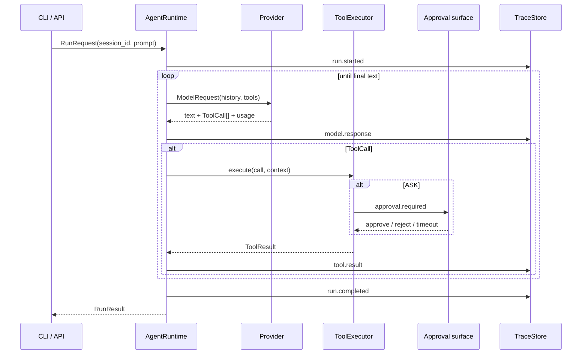

# Nexus Agent 架构

## 稳定边界

```python
await AgentRuntime.run(request: RunRequest, sink: EventSink) -> RunResult
await Provider.complete(request: ModelRequest) -> ModelResponse
await ToolExecutor.execute(call: ToolCall, context: ToolContext) -> ToolResult
```

`AgentRuntime` 是唯一编排核心：加载隔离的 session history，调用 provider，把工具请求交给 policy-aware executor，并把每个阶段写成事件。CLI 与 FastAPI 只是不同的输入、审批和事件输出适配层。



## 并发与状态

- SQLite 保存 session、message、run、event；同一 session 使用 `asyncio.Lock` 串行化。
- 不同 session 使用不同锁和不同持久化历史，因此可以并发。
- todo、权限结果、MCP 会话不通过模块全局变量注入新 Runtime。
- `TraceStore.close()` 显式关闭连接，保证 Windows 临时目录与服务停机能够释放数据库。

## 权限模型

`PolicyEngine` 在工具实现之前执行，文件工具内部再次调用同一作用域解析器，形成入口防护与工具自防护两层边界。

| 决策 | 语义 | 默认行为 |
|---|---|---|
| `ALLOW` | 低风险且在工作区内 | 执行 |
| `ASK` | 可能删除/修改数据或未声明只读的外部 MCP | CLI/Web 请求一次性批准 |
| `DENY` | 越界路径或不可覆盖的危险命令 | 立即拒绝 |

非交互执行、审批超时或无人响应都按拒绝处理。MCP 的只读提示只有在服务端工具 annotations 明确标注时才绕过审批。路径校验位于 `filesystem.py`，因此 CLI、API、subagent 和 teammate 无法通过绕开入口获得不同策略。

## Provider boundary

- Anthropic adapter 把统一消息直接映射到 Messages API。
- OpenAI-compatible adapter 把统一的 `tool_use/tool_result` 往返转换为 Chat Completions tool calls。
- 429/5xx 等可恢复错误转成带 `retryable` 标记的 `ProviderError`，Runtime 指数退避，最多三次。
- 客户端惰性创建；帮助、单测和离线评测不需要 Key。

Provider 不负责策略、持久化或重试循环，这使模型 SDK 的变化不会扩散到执行层。

## MCP 生命周期

`MCPManager` 读取本地 `mcp.json`，通过官方 SDK 管理连接和关闭：

1. 校验 transport 和必填配置。
2. stdio 仅传递显式列入 `env` 的变量；HTTP 通过本地 headers 配置。
3. 建立 client session，发现工具并规范化为 `mcp__server__tool`。
4. 把 schema/handler/只读提示注册到 Runtime。
5. Runtime 关闭时统一退出 async context stack。

mock MCP 只保留为 v0.1 教学测试 fixture，生产路径使用真实 SDK。stdio 已由真实子进程集成测试验证；Streamable HTTP 使用同一官方 transport client。

## Trace 与事件

标准事件包括：

- `run.started/completed/failed`
- `model.request/response/retry`
- `tool.request/result`
- `approval.required/resolved`
- `context.compacted`

事件含序号、时间、耗时、状态、错误和 token usage。字段名匹配 key/token/authorization/secret/password 的值会被替换，大文本在 4,000 字符截断。SSE 读取已持久化事件而不是依赖进程内消息队列，因此页面短暂重连仍可按序号补读。

## 上下文压缩

每轮模型调用前对序列化历史做确定性预算检查；超限时保留最近完整交互并写入压缩标记。工具也可显式请求 `compact`。压缩动作记录为事件，方便评测是否发生，而不是让压缩成为不可观测的隐式副作用。

## Worktree 正确性

创建 worktree 时记录基线 commit。删除前同时检查：

- `git status --porcelain`：未提交文件变化；
- `git rev-list --count base..HEAD`：基线后的本地提交。

因此不依赖是否设置 upstream，也不会把“已提交但未推送”的工作误判为可安全删除。

## 明确不做

本地 shell 不是安全沙箱；没有 Docker 执行器、分布式队列、登录系统、公网部署或复杂前端。这些边界在 README 中公开，避免把策略校验误称为操作系统级隔离。
