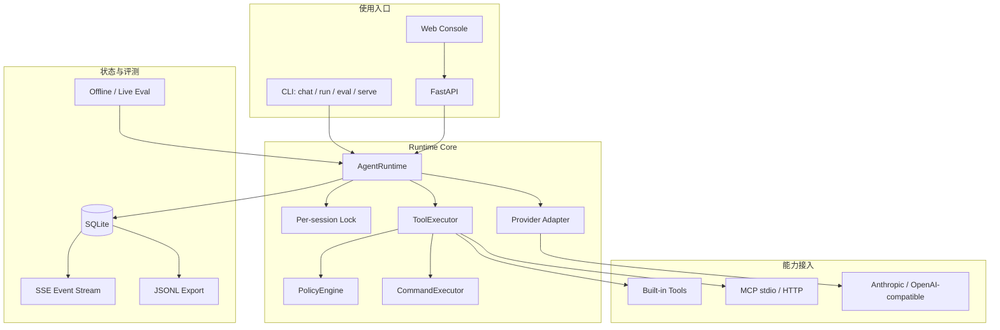

# Nexus Agent 应用面与技术演进说明

> 文档版本：v0.2  
> 更新时间：2026-09-07  
> 适用读者：Agent 工程师、技术面试官、项目维护者和希望基于本项目继续开发的学习者

## 1. 文档目的

本文回答三个问题：

1. 当前 Nexus Agent 能够用于哪些实际场景？
2. 它相较最初从 shareAI Lab `learn-claude-code` 迁移出的教学型 harness，做了哪些升级？
3. 当前版本的能力边界和后续演进方向是什么？

Nexus Agent 并不是一个面向单一业务的成品助手。它更接近一个单机、可嵌入、可观测的 coding-agent runtime：模型负责推理和决定是否调用工具，Runtime 负责会话、工具、权限、MCP、事件、重试和结果交付。

## 2. 当前定位

```text
Nexus Agent = Model Provider + Agent Runtime + Tool/MCP Ecosystem
```

其中：

- Model Provider 提供推理和工具选择能力；
- Agent Runtime 负责可靠执行、状态隔离、权限决策和上下文管理；
- Tool/MCP Ecosystem 提供文件、Shell、任务、协作和外部服务能力；
- SQLite Trace 与 Eval 用于解释和衡量运行结果；
- CLI、HTTP API 和 Web Console 是三种不同的使用入口。

核心接口如下：

```python
await AgentRuntime.run(request: RunRequest, sink: EventSink) -> RunResult
await Provider.complete(request: ModelRequest) -> ModelResponse
await ToolExecutor.execute(call: ToolCall, context: ToolContext) -> ToolResult
await CommandExecutor.execute(command: str, cwd: Path) -> str
```

这些接口将“模型协议”“Agent 循环”“工具执行”和“命令执行”分离，使后续替换模型、执行后端或交互入口时不必重写整个 Agent。

## 3. 当前应用面

### 3.1 本地代码仓库助手

Nexus 可以在指定工作区内完成：

- 阅读、搜索、创建和修改文件；
- 执行本地命令并收集结果；
- 维护 todo 和任务状态；
- 使用 Git worktree 隔离并行任务；
- 通过多轮会话持续处理代码问题；
- 对越界路径和危险命令执行权限判断。

适合用于代码理解、局部重构、测试执行、问题排查和仓库级自动化原型。

当前限制：本地 Shell 不是安全沙箱。Nexus 提供应用层策略和可替换的 `CommandExecutor`，但当前默认实现仍在宿主机执行命令，因此只应在受信工作区和受控用户环境中使用。

### 3.2 Agent Runtime 研发底座

项目可以作为研究或实现 Agent 基础设施的最小参考：

- provider-neutral 的模型边界；
- async-first 的 model/tool loop；
- 同一 session 串行化；
- 工具调用、错误恢复与最大步骤限制；
- 可观测的上下文压缩；
- CLI 与 API 共用同一个 Runtime。

相比只展示 function calling 的示例，Nexus 更适合验证“模型调用之外”的工程问题，例如生命周期、重试、权限、状态、并发和追踪。

### 3.3 MCP Host 与工具集成验证器

Nexus 使用官方 MCP Python SDK，可作为 MCP client/host：

- 连接 stdio MCP 子进程；
- 连接 Streamable HTTP MCP 服务；
- 发现远端工具并转换为统一工具 schema；
- 使用 `mcp__server__tool` 避免工具名称冲突；
- 对 stdio 子进程只透传显式白名单环境变量；
- 根据 MCP tool annotations 识别只读工具；
- 将未声明只读的 MCP 操作纳入审批流程。

因此它适合开发和验收自定义 MCP server，或者验证同一外部工具能否被不同模型 provider 正确调用。

当前仓库已经通过真实 stdio 子进程和本地 Streamable HTTP 服务完成工具发现与调用测试。旧的 mock MCP 只为 v0.1 教学兼容保留，不属于当前生产路径。

### 3.4 国内兼容模型接入与横向评测

Nexus 提供两类 provider adapter：

- Anthropic Messages；
- OpenAI-compatible Chat Completions tool calling。

国内模型服务只要实现相应兼容协议，原则上可以通过以下配置接入，而不需要在 Runtime 内增加厂商分支：

```dotenv
NEXUS_PROVIDER=openai_compatible
NEXUS_API_KEY=...
NEXUS_BASE_URL=https://provider.example/v1
NEXUS_MODEL=tool-capable-model
```

这使 Nexus 可用于比较不同模型的工具选择、恢复能力、步骤数、token 用量和延迟。

需要注意：兼容 API 并不意味着所有模型都完整支持 tool calling。具体模型、参数、上下文长度和错误格式仍需以供应商当前文档及 live eval 为准。

### 3.5 Agent 评测与回归平台

离线模式通过 `ScriptedProvider` 固定模型响应，能够确定性验证：

- 直接回答；
- 文件读取；
- 安全 Shell；
- 路径越界拒绝；
- 危险命令审批；
- 工具失败后恢复；
- provider 重试；
- 上下文压缩；
- 多工具调用；
- MCP transport；
- session history 隔离。

离线评测不会访问网络或读取 API Key，适合在 CI 中运行。`--live` 模式使用真实 provider，可进一步衡量模型本身，而不是只验证 Runtime。

报告包含通过率、平均耗时、工具成功率、安全拦截和逐用例结果。预期安全拒绝与真正的工具错误分开统计，避免把“成功阻止危险行为”错误计为系统失败。

### 3.6 可观测 Agent 演示与调试控制台

FastAPI 与原生 Web UI 提供：

- 创建 session；
- 异步提交 run；
- 查询运行状态；
- 通过 SSE 查看实时事件；
- 查看模型、工具、错误、耗时和 token usage；
- 对危险操作批准或拒绝；
- 查看上下文压缩事件和最终回答。

这个界面适合技术演示、运行过程解释和本地调试，也适合作为进一步开发 Agent 产品 UI 的参考实现。

当前 API 没有用户体系、鉴权和租户隔离，因此默认只应绑定 `127.0.0.1` 或部署在受信网络，不能直接作为公网多租户服务。

### 3.7 Agent 工程教学与求职作品集

项目保留了从教学 harness 演进到 runtime 的完整脉络，适合解释：

- Agent loop 与 workflow orchestration 的区别；
- provider boundary 为什么必要；
- MCP 生命周期如何管理；
- 权限确认和操作系统沙箱有什么区别；
- 为什么离线 eval 与 live eval 都需要；
- 如何追踪一个 Agent 的中间行为；
- 如何避免并发会话的 history 交错。

仓库同时明确标注原项目归属与本人新增部分，适合作为 Agent 工程实习面试中的架构讨论材料，而不是把教学代码全部包装为原创。

## 4. 与初始 learn-claude-code Harness 的关系

### 4.1 初始 Harness 提供了什么

最初迁移版本已经具备一个完整教学型 Agent 的主要构件：

- `while True` 模型—工具循环；
- Bash 和文件工具；
- todo、任务图和 worktree；
- hooks 与基础危险命令检测；
- subagent、teammate 和 MessageBus；
- cron/background task；
- skills 与 context memory；
- 上下文裁剪和 Anthropic 错误恢复；
- 两个内存 mock MCP server；
- 交互式终端入口。

这些能力证明了“Agent = Model + Harness”的基本概念，但更偏教学：模块之间仍直接依赖 Anthropic SDK、全局状态和同步线程模型，也缺少统一 API、持久化 trace、可复现评测与跨平台质量门禁。

### 4.2 当前版本保留了什么

Nexus 没有删除原来的工具、任务、协作、调度和 skills 能力。`agent.py`、旧 context/hooks、cron 和部分 mock 路径作为 v0.1 compatibility layer 保留，便于理解来源并降低迁移风险。

新功能优先进入 v0.2 生产路径：

```text
runtime.py
providers/
executor.py
policy.py
observability.py
mcp/client.py (real SDK path)
api.py
evaluation.py
web/
```

因此当前仓库同时包含“教学能力来源”和“生产化 Runtime 实现”，两者不应混为一谈。

## 5. 升级与调整对照

| 维度 | 初始 Harness | 当前 Nexus Agent | 工程价值 |
|---|---|---|---|
| 初始化 | import 时创建 Anthropic 客户端 | Settings 与客户端惰性初始化 | `--help`、测试和离线 eval 不再需要 Key |
| Agent loop | 同步函数和全局锁 | async-first `AgentRuntime.run` | FastAPI 可直接 await，不阻塞整个服务 |
| 模型边界 | 直接调用 Anthropic SDK | `Provider.complete` 统一协议 | 可替换 Anthropic/OpenAI-compatible provider |
| 消息格式 | 与 Anthropic block 耦合 | `ModelRequest/ModelResponse/ToolCall` | 协议转换集中在 adapter 中 |
| 工具执行 | handler 分散调用 | `ToolExecutor.execute` | CLI、API 和 Agent 共用一个执行边界 |
| 命令执行 | Bash handler 直接启动宿主进程 | `CommandExecutor` Protocol + Local 实现 | 为 Docker/微虚拟机执行器预留替换点 |
| 权限 | 以全局 PreToolUse hooks 为主 | `PolicyDecision(ALLOW/ASK/DENY)` | 权限结果可测试、可展示、可跨入口复用 |
| 默认策略 | 部分危险操作依赖 CLI 询问 | 无审批 handler、超时或无人响应默认拒绝 | 非交互 API 不会隐式放行 |
| 文件安全 | 主要在调用入口判断 | 文件工具内部再次解析工作区路径 | 防止绕过 CLI 直接调用 handler |
| Agent 名称 | 名称校验不足 | teammate/worktree 名称白名单 | 防止路径穿越和恶意状态文件名 |
| Worktree | 依赖 upstream 判断改动 | 记录创建基线，检查 status 与 `base..HEAD` | 能识别已提交但未推送的工作 |
| MCP | 固定内存 mock | 官方 SDK，stdio + Streamable HTTP | 可接真实外部进程和服务 |
| MCP 环境 | 无真实子进程边界 | 显式 env allowlist | 减少向 MCP server 泄露宿主变量 |
| 状态 | history 和多个子系统依赖进程内全局对象 | session/message/run/event 持久化到 SQLite | 可恢复查询，可供 SSE 和评测读取 |
| 并发 | 单个全局 Agent 锁 | session 粒度锁 | 同一会话有序，不同会话可并发 |
| Trace | 主要依赖终端输出和 transcript | 标准化 run/model/tool/approval/compaction 事件 | 可以解释每一步发生了什么 |
| 数据安全 | 无统一 trace 脱敏 | 按敏感字段脱敏，大结果截断 | 降低 Key 和大体积输出落盘风险 |
| 评测 | pytest 验证模块函数 | scripted offline eval + opt-in live eval | CI 可确定性验证 Agent 行为 |
| CLI | 只有交互模式 | `chat/run/eval/serve` | 支持人机交互、脚本和服务三类用法 |
| API | 无 | FastAPI session/run/events/approval API | Runtime 可嵌入其他应用 |
| Web | 无 | 原生 HTML/CSS/JS 运行控制台 | 无 npm 即可展示事件时间线 |
| 依赖管理 | requirements 文件为主 | `pyproject.toml` + 跨平台 `uv.lock` | 新鲜环境更容易复现 |
| 质量门禁 | 本地 pytest | Ruff、mypy、pytest、coverage、GitHub Actions | 形成可自动执行的工程基线 |
| 文档 | 英文快速说明 | 中英文 README、架构、面试、简历和截图 | 明确来源、指标与设计边界 |

## 6. 当前运行架构



一次典型运行过程是：

1. surface 创建或复用 session，提交 `RunRequest`；
2. Runtime 获取该 session 的锁并加载历史；
3. 超出预算时压缩上下文并写事件；
4. provider 返回文本、工具调用和 usage；
5. 工具调用经过 policy；
6. `ASK` 通过 CLI 或 API 发出审批，超时则拒绝；
7. ToolResult 回到模型历史；
8. 最终文本、步骤、耗时和 token 汇总为 `RunResult`；
9. Web 通过 SSE 从 SQLite 增量读取整条时间线。

## 7. 可靠性与安全调整

### 7.1 路径作用域

文件路径通过 `Path.resolve()` 得到真实位置，并要求结果仍位于 workspace root 下。这个判断位于文件工具自身，因此不仅保护 Web/CLI，也保护直接 handler 调用和旧 subagent 路径。

### 7.2 危险命令审批

命令分三类：

- 低风险命令：直接执行；
- 可恢复但可能破坏数据的命令：`ASK`；
- `rm -rf /`、`mkfs`、`shutdown` 等不可覆盖风险：`DENY`。

策略层不能等价于安全沙箱。Shell 语法和可执行程序具有巨大表达能力，真正面向不可信输入时仍需容器、微虚拟机、低权限账号和资源限制。

### 7.3 Trace 脱敏

事件写入 SQLite 前递归处理：

- key 名匹配 `api_key`、`authorization`、`token`、`secret`、`password` 时替换为 `[REDACTED]`；
- 超过 4,000 字符的字符串截断；
- 运行数据库、`.env`、本地 MCP 配置和 eval 报告默认不提交 Git。

### 7.4 会话隔离的准确边界

当前已经验证：

- 不同 session 的消息历史不会互串；
- 同一 session 的 run 会串行执行；
- 每次审批使用独立 approval id；
- run/event 按独立 id 持久化。

需要准确说明：MCP 连接池当前属于一个 `AgentRuntime` 实例，而不是为每个 session 建立独立连接。若外部 MCP server 自身维护会话态，其隔离能力还取决于该 server 的设计。当前版本不应宣称拥有跨租户 MCP 强隔离。

## 8. 可复现性与验证结果

本机验证环境为 Windows、Python 3.14.2：

| 验证项 | 当前结果 |
|---|---:|
| pytest | 66 passed |
| 生产 Runtime 覆盖率 | 87.47% |
| Ruff | passed |
| mypy | 43 source files, no issues |
| offline smoke eval | 10 / 10 |
| 平均离线用例耗时 | 49.40 ms |
| 工具成功率 | 85.71% |
| 预期安全拦截 | 2 |
| MCP stdio | 真实子进程发现与调用通过 |
| MCP Streamable HTTP | 本地服务发现与调用通过 |

覆盖率统计 v0.2 生产 Runtime，v0.1 教学兼容层在 `pyproject.toml` 中显式排除。离线延迟只表示本地回归成本，不代表真实模型推理性能。

GitHub Actions 已配置 Ubuntu Python 3.10–3.14，以及 Windows/macOS Python 3.12 smoke test。仓库尚未配置 remote，因此这些云端矩阵仍需在用户授权发布后验证。

## 9. 当前不适合的场景

Nexus v0.2 不应直接用于：

- 面向不可信用户开放的公网 Shell Agent；
- 需要强租户隔离的 SaaS；
- 分布式、高可用或大规模队列执行；
- 带账号、计费、权限组织架构的企业平台；
- 对操作系统隔离有合规要求的生产环境；
- 未验证 tool calling 能力的模型服务；
- 依赖浏览器、移动端或复杂多模态交互的完整产品。

这些不是文档遗漏，而是当前版本主动限定的范围。

## 10. 推荐演进方向

### 近期

1. 使用一个真实国内兼容模型分别完成 CLI、Web 和 live eval 验收；
2. 基于真实 trace 记录模型成功率、P50/P95 延迟和 token 成本；
3. 发布 GitHub remote 并验证完整 CI 矩阵；
4. 为 MCP HTTP 增加认证失败、断线和重连测试；
5. 增加 trace replay 和历史 run 查询接口。

### 中期

1. 为 `CommandExecutor` 实现 Docker 或微虚拟机后端；
2. 将 Runtime 内的 MCP 连接作用域显式建模为 runtime/session/run；
3. 增加 provider capability negotiation；
4. 为 SQLite schema 增加版本迁移；
5. 通过独立 worker 执行长任务，同时保持事件协议不变。

## 11. 总结

初始 learn-claude-code harness 的重点是展示一个模型如何通过工具、任务、记忆和协作变成 Agent。当前 Nexus Agent 的升级重点，则是回答另一个问题：如何让这个 Agent 可运行、可评测、可追踪、可审批、可嵌入，并且能够在没有 API Key 的 CI 环境中稳定验证。

它目前最合适的身份不是“完整商业 Agent 平台”，而是：

> 一个面向 coding-agent 与 Agent Infrastructure 学习、实验、评测和作品展示的单机 Runtime 基线。

这个定位既保留了教学 harness 的可理解性，也加入了真实 Agent 工程岗位关注的 provider boundary、MCP、状态、评测、可观测性、安全默认值与并发控制。
